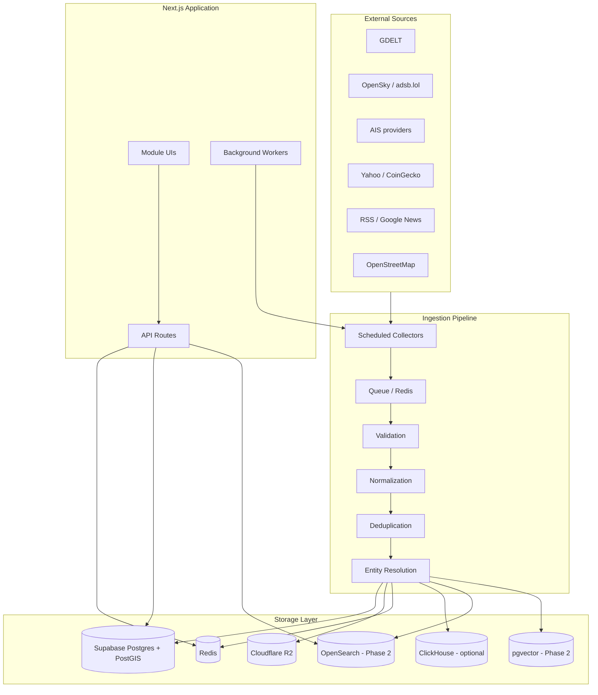

# EarthOS Target Architecture

## Design principles

1. **Supabase PostgreSQL + PostGIS** — transactional system of record (config, ontology, users, snapshots)
2. **Cloudflare R2** — raw/compressed payloads, Parquet, evidence (batched, partitioned)
3. **Redis** — cache, locks, rate limits, checkpoints, short-lived state
4. **ClickHouse** (optional, prod) — high-volume time-series analytics via adapter
5. **OpenSearch** (Phase 2) — lexical + faceted + geo search
6. **pgvector** (Phase 2) — semantic retrieval over entities, stories, investigations

Local development runs without ClickHouse/OpenSearch; adapters degrade gracefully.

---

## System diagram



---

## Ingestion pipeline

```text
Sources → collectors → queue → raw archive (R2) → validation → normalization
  → deduplication → entity resolution → indexes → alerts → APIs → UI
```

Every ingestion record includes:

```ts
source_id, provider, external_id, ingested_at, observed_at, source_url,
content_hash, schema_version, raw_object_key, processing_status, reliability_score
```

Collectors **never** run inside user search requests (Phase 2+ enforcement).

---

## Memory model (neuro-symbolic)

| Level | Store | Retention |
|-------|-------|-----------|
| L1 Working | Redis | seconds–minutes |
| L2 Raw | R2 (compressed) | hours–days |
| L3 Episodic | R2 / ClickHouse | days–months |
| L4 Semantic | PostgreSQL ontology | permanent |
| L5 Vector | pgvector | selective |

---

## Cost controls

| Threshold | Action |
|-----------|--------|
| 60% quota | Warning |
| 75% | Reduce low-priority polling |
| 85% | Pause low-priority global sources |
| 90% | Watchlists + viewport only |
| 95% | Emergency cleanup |
| 98% | Block non-essential writes |

**Supabase target:** operational < 300 MB, reserve ≥ 150 MB.

---

## Security model (target)

- Organisation-scoped tenant isolation (Phase 2 auth)
- Service role for server writes only
- No anon write policies
- URL allowlists + SSRF protection on fetchers
- API rate limits per route class
- Encrypted source credentials in `data_sources.config_json`

---

## Current vs target (Phase 0–1)

| Capability | Before | After Phase 1 |
|------------|--------|---------------|
| Source config | Hardcoded TS | `data_sources` table + seeds |
| Connector health | Fake `ok: true` | `unknown` until verified |
| Raw archive | None | R2 adapter (optional) |
| Cache | globalThis | Redis adapter + fallback |
| RLS | Open | Deny client roles |
| Rate limits | None | Per-route limits |
| Usage tracking | None | `/api/usage` + DB table |
